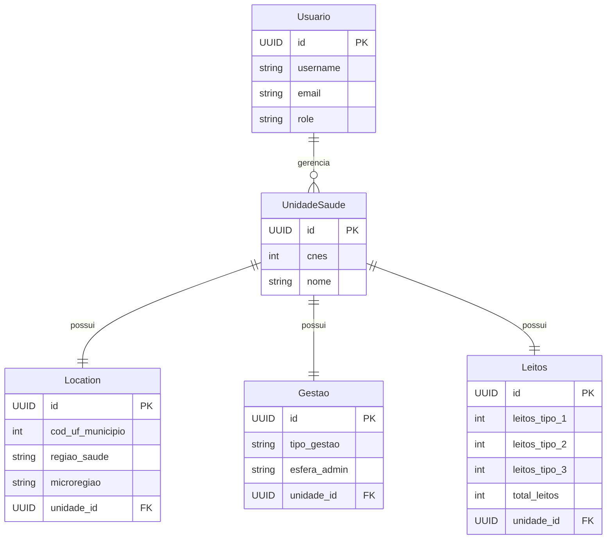

🏥 API REST - UNIDADE DE SAÚDE (CNES)

[](https://python.org)
[](https://fastapi.tiangolo.com)
[](https://sqlalchemy.org)
[](http://18.118.167.28:8000)

📋 Descrição

API RESTful para disponibilização de dados públicos de unidades de saúde, baseada no Cadastro Nacional de Estabelecimentos de Saúde (CNES), com foco em organização, segurança e boas práticas de desenvolvimento.

🏗️ Arquitetura em Camadas:
°🚀 Presentation Layer: FastAPI routers (routers/)
°⚙️ Service Layer: Lógica de negócio (services/)
°🏗️ Data Layer: Models SQLAlchemy (models/)
°🔐 Security Layer: Autenticação JWT (auth.py)
°📊 Validation Layer: Schemas Pydantic (schemas.py)

> 📊 **Dados reais** do governo brasileiro via dados.gov.br
>
> ## ✨ Funcionalidades Principais

- 🔐 **Autenticação JWT** com controle de permissões
- 📊 **CRUD completo**
- 🔍 **Filtros avançados**, ordenação e paginação
- ✅ **Validação de CNES** integrada com dígitos verificadores
- 📂 **Import/Export** de dados CSV do dados.gov.br
- 🔄 **Migrations Alembic** para versionamento de banco

## 🏃‍♂️ Início Rápido

### 💻 **Desenvolvimento Local (Recomendado)**

# 1. Clone o repositório

https://github.com/elielguedes/Projeto-fastapi.git

# 2. Crie e ative ambiente virtual (Python 3.10+)

python -m venv .venv

# Windows PowerShell

\.venv\Scripts\Activate.ps1

# Linux/Mac

source .venv/bin/activate

# 3. Instale dependências

pip install -r requirements.txt

# 4. Inicie aplicação (SQLite automático)

python -m uvicorn app.main:app --reload --host 127.0.0.1 --port 8000

### 🚀 **Acessar Aplicação**

#### 💻 **Local (Desenvolvimento)**

- 🌐 **API**: http://127.0.0.1:8000
- 📚 **Docs**: http://127.0.0.1:8000/docs
- ❤️ **Health**: http://127.0.0.1:8000/health

## 📁 Estrutura Organizada do Projeto

```
|__🚀app/
    |___core/
        |___ __init__.py
        |__ config.py
        |__ logs.py
        |__ security.py
    |__models/
        |__ __init__.py
        |__ entidade1.py
        |__ entidade2.py
        |__ user.py
    |__routes/
        |__ __init__.py
        |__ auth.py
        |__ entidade1.py
        |__ entidade2.py
    |__schemas/
        |__ __init__.py
        |__ entidade1.py
        |__ entidade2.py
        |__ schemas_backup.py
        |__ user.py
    |__services/
        |__ __init__.py
        |__ auth_service.py
        |__ entidade_saude.py
        |__ entidade_service.py
      __init__.py
     💾database.py
    🚀main.py
|__backup/
    |__ __init__.py
    |__ backup.py
|__csv/
  |__ cnes.csv
  |__ organization.py
|__docs/
  |__cronograma.md
|__logs/
  |__ app.logs
|__scripts/
  |__ __init__.py
  |__ import_cnes.py
  |__ import_gestao.py
  |__ import_leitos.py
  |__ import_location.py
|__tables/
  |__ create_tables.py
|__tests/
    |__ __init__.py
    |__ conftests.py
    |__ test_entidade1.py
    |__ test_entidade2.py
    |__ test_user.py


app.db
alembic.ini
README.md
pytest.ini
requeriments.txt
tests.db
docker-compose.yml
dockerfile
requeriments.txt

```

## 📊 Diagrama ER - Modelagem de Dados



## Origem dos Dados

- Fonte: [dados.gov.br](https://dados.gov.br)
- Formato: CSV
- Periodicidade: conforme atualização oficial

## Scripts de importação / exportação
    -- Importação dos dados em csv convertidados para o banco de dados
    |-- __init__.py
    |-- import_cnes.py
    |-- import_gestao.py
    |-- import_leitos.py
    |-- import_location.py

## Tests de integração 
    -- Testes de integração com conexão com banco de dados cache 
    -- tests de authenticação e rotas 
    |__ tests/
    |__ __init__.py
    |__ conftests.py
    |__ test_entidade1.py
    |__ test_entidade2.py
    |__ test_user.py

## Migração do banco de dados usando alembic 
 -- Utilizado para fazer auterações do banco em produção com mais facilidade

## Sobre a arquitetura de camadas
-- Foi ,  escolhida para ter booas práticas de desenvolvimento é para organização do projeto.
-- Como , Apretação no caso schemas , regra de negocio no services , repositorios que são as rotas,
-- o models o banco de dados e etc para ter tudo em conjunto funcionando para não embaraçar a lógica 
-- é muito usadas para requisições HTTPS . Use se também para separar a regra de négocio e não ficar
-- só no sql. Que garantem melhor perfomace , manuntenabilidade ,funcionamento muito comuns em apirest.
-- já a desvantagens seria muitos arquivos , é complicações no começo do desenvolvimento com muitos códigos.
-- Seria como se fosse dividir e conquistar isso é arq. em camadas

## Backup do banco de dados
-- Na patsa backup uma pasta que faz o backup do banco de dados para deixar mais profissional para produção

## Dockerizado 
-- Usando docker compesente com imagem , é dockerfile 
-- Linux ubutu usando como maquina virtual

## Logs 
-- Usado para facilitar o entender o que está acontecendo no código 
--Se , uma rota falhar ou se tiver bugs facilita para debung ou uma informção do que está acontecendo na rota


